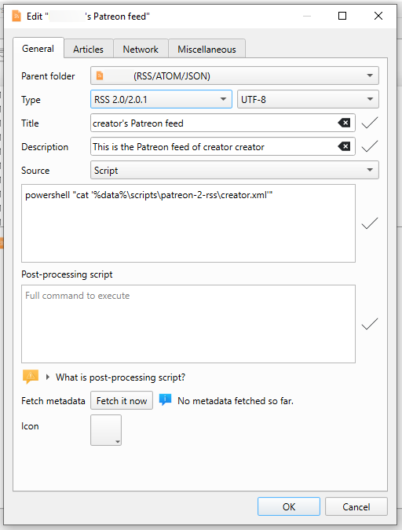

# patreon-2-rss 

Scrapes patreon.com using puppeteer and converts posts into a RSS feed which can be imported into readers such as RSS Guard (https://github.com/martinrotter/rssguard/).

## Requirements

- Node.js (https://nodejs.org/en)

## Usage

`node scraper.js creator [creator]`

The script will scrape the creators `/posts` page and dump the information into a `creator.xml` file in RSS 2.0 format. 

`creator` will be replaced by the command line argument passed to the script. If multiple arguments were specified, multiple files will be created.

## RSS Guard Usage

Specify which creator you want to import, by replacing `creator` in `creator.xml` according to the file the script generated.

I recommend symlinking the folder to which you cloned this repo (e.g. `patreon-2-rss`) to a `scripts` folder in the RSS Guard `%data%` directory, which you will have to create yourself.

- On Windows: `powershell "cat '%data%\scripts\patreon-2-rss\creator.xml'"`

